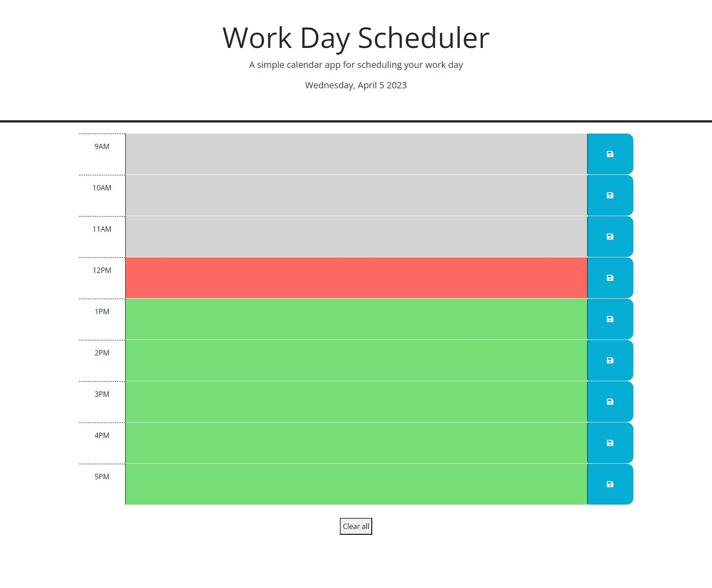

# Work Day Scheduler

## Description

This work day scheduler is a functional tool for live hour by hour tracking of tasks to be completed throughout the current day. The website color-codes the hour based on the current hour of the day. User input is saved in local storage and is displyed in the hour rows when the page is refreshed. This project was intended to utilize jquery and day.js techniques. Starter HTML and CSS code was provided. 

This application is deployed on GitHub pages: 
https://danielschris96.github.io/work-day-scheduler/

## Usage
The hours of the day are color-coded. Gray blocks represent past hours. The red block represents the current hour. Green blocks represent future hours. The user can input text into any hour block and save the text using the blue button next to the block. When the page is refreshed, the inputed tasks remain in the blocks. The scheduler can be cleared using the 'Clear all' button. 

## Credits

https://stackoverflow.com/questions/4659492/using-javascripts-parseint-at-end-of-string 
https://developer.mozilla.org/en-US/docs/Web/JavaScript/Reference/Global_Objects/parseInt 
https://api.jquery.com/id-selector/ 
https://api.jquery.com/on/ 
https://stackoverflow.com/questions/12481439/jquery-this-keyword 
https://www.w3schools.com/jsref/met_storage_key.asp 
https://day.js.org/docs/en/display/format 

## License

None